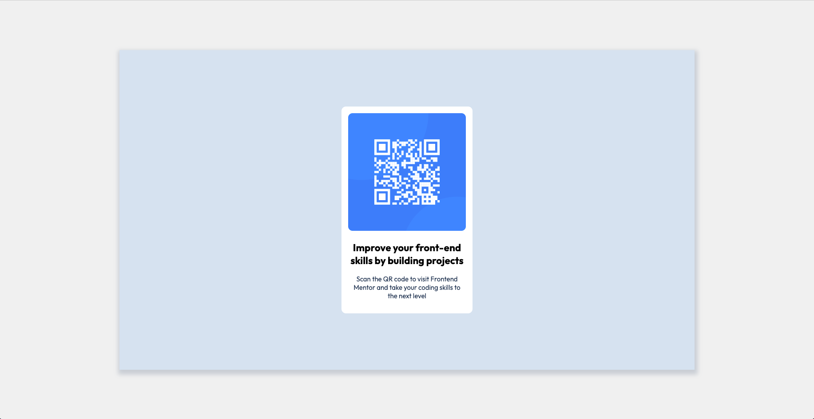
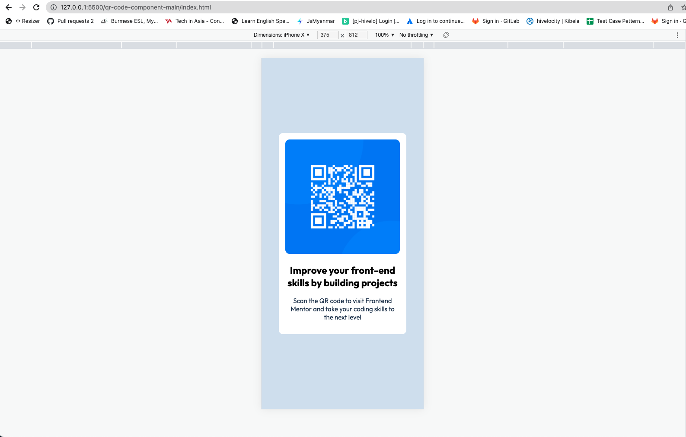

# Overview

This is a solution to the [QR code component challenge on Frontend Mentor]

### Screenshot

### Links

https://aps-ohnmar.github.io/qr-code-component.github.io/

## My process

### Built with

- Semantic HTML5 markup
- CSS custom properties
- Flexbox
- Mobile-first workflow

### What I learned

- paratice of moblie first view
